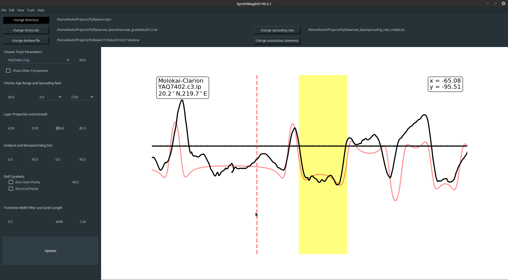
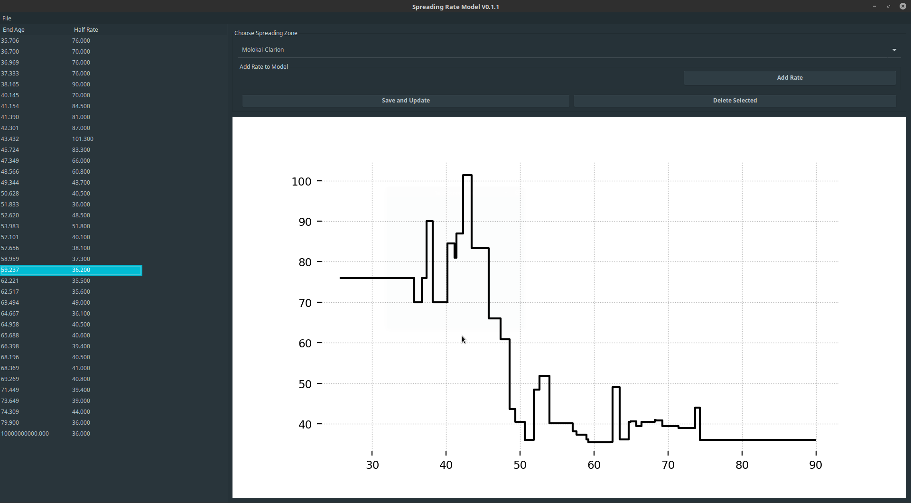
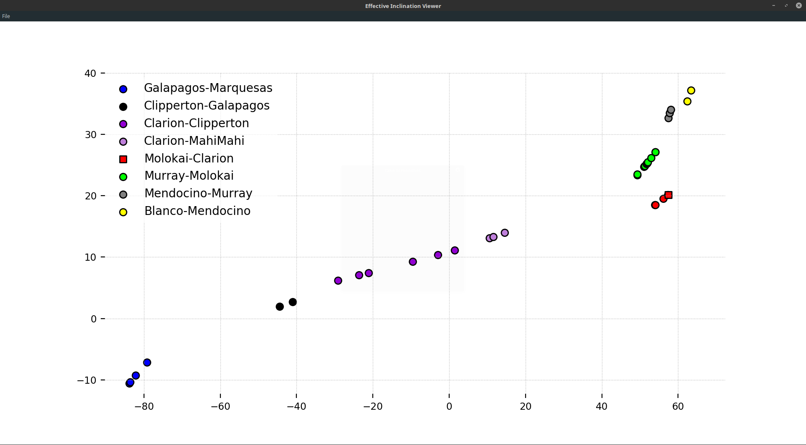

# PySkew: Tools for Skewness Analysis of Marine Magnetic Anomalies

PySkew is an open source library for analysis of marine magnetic anomalies in geophysical trackline data. It supports an interactive analysis which seaks to make easier and faster the numerous tectonics studies based on this form of data.  

Though originally written by Kevin Gaastra (kmg9@rice.edu) as an exersise during his PhD. work which involved skewness analysis of marine magnetic anomalies, it has expanded to enable other forms of analysis of marine magnetic anomalies though its main focus still remains skewness analysis.  

## How to Install

Download or clone the repository above and install Python3 as well as these libraries:  

- numpy (can be installed with pip, anaconda, or aptitude)
- pandas (can be installed with pip, anaconda, or aptitude)
- matplotlib (can be installed with pip, anaconda, or aptitude)
- cartopy (can be installed with pip, anaconda, or aptitude)
- geographiclib (can be installed with pip, anaconda, or aptitude)
- pmagpy (can be installed with pip or at their github repository [here](https://github.com/PmagPy))
- rdp (can be installed with pip)
- wx (can be installed with pip, anaconda, or aptitude) (optional: required for use of the GUIs) 
- qt (can be installed with pip, anaconda, or aptitude) (optional: if installed this backend will be used on mac for data visuals)

If you are new to Python it is suggested that you install python using the [Anaconda framework](https://www.anaconda.com/download)

Once everything is installed you will need to add the main PySkew directory to your PYTHONPATH environment variable (scripts to automate this process are in development). So if you are running a Mac or Linux based operating system add:
```bash
export PYTHONPATH="$PYTHONPATH:$PATHTOPYSKEW"
```
to your .bashrc file or other init file. If you are running Windows you will need to open a terminal and type:
```dos
setx PYTHONPATH $PATHTOPYSKEW
```
Note that you need to replace $PATHTOPYSKEW with the actual path to the main PySkew directory on your disk not simply copy and paste the above.

## Magnetic Track Data Source

This library is meant to be used with data from the NCEI database found [here](https://maps.ngdc.noaa.gov/viewers/geophysics/) which has ship and aero magnetic trackline data, though only the shipmag data is directly downloadable through the linked viewer.

## Preprocessing Data

Once data has been obtained it needs to be preprocessed for use in the PySkew framework. This is done by using the batch preprocessing scripts shipmag\_prep.py and aeromag\_prep.py which removes IGRF 12 from the total component data and interpolates the sparser parts of the data files.

## Data Selection and Trimming

The first phase of analyzing magnetic trackline data is picking out useful tracks from your raw\_data. The parameters needed for this stage can be found in template.inp which gives an example for analysis of C20r and should be repopulated with your analysis parameters. Picking out useful tracks is then done by looking for intersections with isochrons a number of which are provided in the repository from Cande 1989 and Barckhausen 2013. You can use any isochrons you want from [The Global Seafloor Fabric and Magnetic Lineation Data Base Project](http://www.soest.hawaii.edu/PT/GSFML/) which has an extensive library. Currently taking data from this database and putting it in this library is a little complicated but a processing script to automate this is in progress. This intersection with an isochron is used to calculate site location and azimuth of the magnetic lineation. Trackline data is then segmented using the [RDP line simplification algorithm](https://en.wikipedia.org/wiki/Ramer%E2%80%93Douglas%E2%80%93Peucker_algorithm) and looking for turns in the data exceeding a threshold. This is all then output to a .deskew file for further analysis.  

Running these selection and trimming processes can be done using the the track\_processing.py script. For help using this script refer to the in code documentation by opening a terminal running:  

```bash
python track_processing.py -h
```

## SynthMag GUI

SynthMagGUI is really the bulk mover in this library at this point. It is an interactive viewer which overlays a synthetic seafloor on trackline magnetic data for analysis of skewness or spreading rate as shown below.  



This GUI supports interactive alterations to all aspects of the synthetic, the phase, projection azimuth, and projection point (site location) of the data. This means you can define isochrons from sets of magnetic track lines for use in Hellenger 1981's algorithm for plate reconstructions, analyse skewness to determine paleomagnetic poles as described in Schouten and Cande 1976, or determine spreading rate for long durations of geologic time.  

### Spreading Rate Viewer

This viewer allows alteration of the spreading rate file directly from the GUI and is useful for determining half-rates from magnetic anomalies over long durations. When enabled by loading in a spreading rates file or checking the option in the edit menu this model is used to map the time synthetic created from the timescale file into distance space and comapre it to the magnetic data.  



### Effective Inclination Viewer

In Skeweness analysis it is common to view the effective inclination as a function of latitude to determine the paleo-equator and therefore easily diagnose your least squares pole position, as well as determine spacial relationships between the magnetic result of individual tracks. This tool makes that analysis easy and can be used to change tracks by double clicking making it easier to analyse your data in order by latitude or effective inclination.



## Licensing

This code can be freely used, modified, and shared. It is licensed under a 3-clause BSD license. See [LICENSE](https://github.com/Rice-Tectonics-Group/PySkew/blob/master/LICENSE) for details.

## References

- Cande, SC, Labrecque JL, Larson RL, Pittman III WC, Golovchenko X.  1989.  Magnetic lineations of the world's ocean basins. :13-13., Tulsa, OK, United States (USA): Am. Assoc. Pet. Geol., Tulsa, OK

- Barckhausen, U., M. Bagge, and D. S. Wilson (2013), Seafloor spreading anomalies and crustal ages of the Clarion-Clipperton Zone, Mar. Geophys. Res., 1-10.
